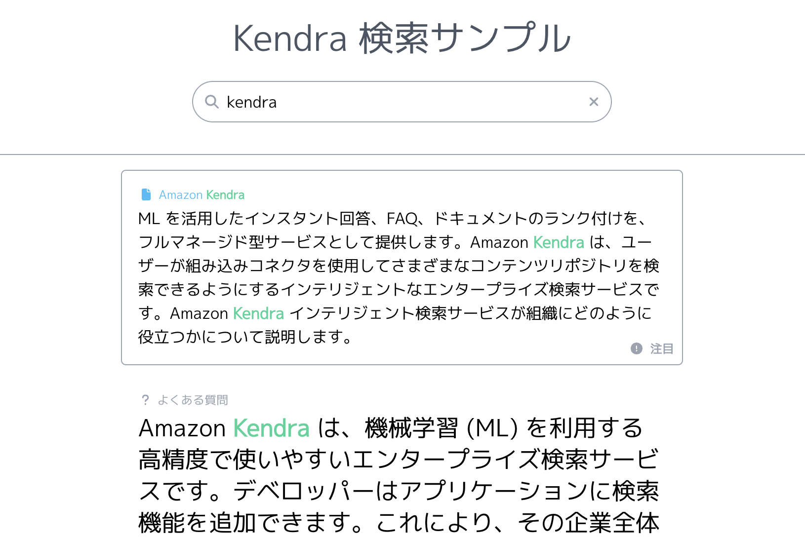

# Amazon Kendra プロジェクトのデプロイ

> コマンドはルートディレクトリ [/simple-lex-kendra-jp](/) で実行してください。

## デプロイメント

以下のコマンドを実行してください。途中でセキュリティに関連した変更について確認が求められますので、`y` を入力して Enter キーを押下してください。確認をスキップしたい場合は、デプロイコマンドに `--require-approval never` オプションを追加してください。(これに続くドキュメントでは、以下のコマンドを単に `cdk deploy SimpleKendraStack` と記述しています。)

```bash
npm exec -w cdk -- cdk deploy SimpleKendraStack
```

以下のような出力であれば成功です。`SimpleKendraStack.KendraSampleFrontend` にサンプルの URL が表示されていますが、アクセスする前に、以下のデータ取り込みを実施してください。

```
SimpleKendraStack.DataSourceBucketName = ...
SimpleKendraStack.ExportsOutputFnGetAttKendraIndexArn7ABEB122 = ...
SimpleKendraStack.ExportsOutputRefKendraIndex7C32BDCD = ...
SimpleKendraStack.IdentityPoolId = ...
SimpleKendraStack.KendraApiEndpointF276F28B = ...
SimpleKendraStack.KendraIndexId = ...
SimpleKendraStack.KendraSampleFrontend = ...
```

## データの取り込み

サンプルのサイトを開く前に、データの取り込みを手動で行います。

[Amazon Kendra](https://console.aws.amazon.com/kendra/home) を開き、simple-index-by-cdk を選択して、左カラムの Data sources から s3-data-source をクリックします。右上の Sync now をクリックして、同期を実施してください。

それでは、サンプルのプロジェクトにアクセスします。デプロイ完了時 AWS CDK が出力した `SimpleKendraStack.KendraSampleFrontend` の URL にアクセスしてください。例えば、「パスワードの更新」と検索すると、必要なツール名が表示されると思います。

> - 検索対象は [`/cdk/docs`](/cdk/docs) のテキストファイルです。そちらの内容をクエリのヒントにしてください。

## ドキュメントの追加/変更 (オプショナル 1)

ドキュメントを追加/変更する場合は、[`/cdk/docs`](/cdk/docs) ディレクトリにてドキュメントの追加/変更をし、再度 `cdk deploy SimpleKendraStack` を実行して、手動で DataSource の Sync を実施します。

> - 簡単のため、サンプルのドキュメントとしてとしてテキストファイル (`.txt`) を利用していますが、`.pdf` や `.html` などでも取り込めます。サポートされているファイルのフォーマットは[こちら](https://docs.aws.amazon.com/kendra/latest/dg/index-document-types.html)。

## FAQ の追加/変更 (オプショナル 2)

FAQ を追加/変更する際は、[`/cdk/faq`](/cdk/faq/simple.csv) に内容を追加/変更をします。続いて、[`/cdk/lib/simple-kendra-stack.ts`](/cdk/lib/simple-kendra-stack.ts) の `new Faq(...)` の `Name` を `simple-faq` から `simple-faq2` に変更します。その後、`cdk deploy SimpleKendraStack` を実行します。

FAQ は作成と同時にデータの取り込みが行われ、データソースにアップデートが入っても、内容はアップデートされません。そのため、データソースにアップデートが入った場合、新しくリソースを作り直す必要があります。`Name` を変更することで、内部的に FAQ の削除/作成を行い、内容のアップデートを行っています。

> - 変更後の名前は `simple-faq2` である必要はありません。変更されていれば、なんでも良いです。

## Custom Data Source の追加 (オプショナル 3)

Amazon Kendra は多くの Native connectors を提供しています。([参考: Connectors](https://aws.amazon.com/kendra/connectors/)) しかし、中にはこれらの Connectors 以外のデータソースを利用したい場合もあると思います。その際に利用するのが Custom Data Source です。Custom Data Source にデータを追加する場合は、データのクロール、ドキュメントごとの ID の発行、インデックスしているドキュメントの管理などは独自で実装する必要があります。ここでは、それらは実装済みのものとして、基本的なインデックスへの登録方法のみを実装しています。

データを挿入するための Lambda 関数は CDK でデプロイ済みです。[`/cdk/lambda/sync-custom-data-source.ts`](/cdk/lambda/sync-custom-data-source.ts) の `demoDocuments` という変数にインデックスするデータが定義されています。では、この Lambda 関数を実行します。[Lambda のコンソール](https://console.aws.amazon.com/lambda/home) を開き、SimpleKendraStack-SyncCustomDataSourceFunc... で始まる名前の関数をクリックしてください。ページ中部の Test タブをクリックして、右上の Test を実行してください。この際、パラメータなどは特に見ていないので、デフォルトのままで問題ありません。

実行に成功したら、[Amazon Kendra](https://console.aws.amazon.com/kendra/home) を開き、左カラムの Data sources から custom-data-source をクリックして、Sync run history を確認してください。Indexing... と表示されていればインデックス中で、Succeeded と出れば成功しています。Added の列は 1 になっているはずです。(1 つのドキュメントを追加。)

ではサンプルサイトにアクセスして、追加したドキュメントの内容を検索してみましょう。Kendra についてのドキュメントを追加したので、「Kendra」と検索してみてください。

このように、データさえフェッチできれば、基本的にはどのようなドキュメントでも Kendra に追加できます。この Lambda 関数を定期実行にすれば、自動で Indexing を実行することも可能です。また、今回はデータ形式として PLAIN_TEXT を指定していますが、HTML や PPT、PDF など多くのフォーマットにも対応しています。([参考: Types of documents](https://docs.aws.amazon.com/kendra/latest/dg/index-document-types.html))

## Web Crawler の追加 (オプショナル 4)

Web ページをクローリングして、コンテンツを Amazon Kendra の Index に登録します。例として [AWS の Wikipedia](https://ja.wikipedia.org/wiki/Amazon_Web_Services) をクロールします。

なお、Web Crawler についてはデフォルトでデプロイされず、コメントアウトしてあります。[`/cdk/lib/simple-kendra-stack.ts`](/cdk/lib/simple-kendra-stack.ts) を開き、`// Web Crawler の実装例` 以下でコメントアウトされているコードをアンコメントしてください。その後、デプロイコマンドを実行して Amazon Kendra の画面を開き、Data Source に webcrawler-data-source が追加されたことを確認します。最後に右上の Sync now をクリックしてデータを取り込みます。

それらが完了したら、「AWS とは」などで検索を行ってみてください。

## Featured Results を試してみる (オプショナル 5)

[Featured Results (注目の検索結果)](https://docs.aws.amazon.com/ja_jp/kendra/latest/dg/featured-results.html) とは、特定のクエリを実行したときに、特定のドキュメントを検索結果に表示する機能のことです。利用者に注目して欲しいドキュメントをこちらに登録することで、優先して検索結果を表示したり、強調して検索結果を表示することが可能になります。Featured Results として検索されたドキュメントは、通常の検索結果 (ResultItems) には含まれませんので、ご注意ください（重複して検索されません）。

こちらのサンプルコードでは、Featured Results は以下のように表示されます。
  

Featured Results は、Amazon Kendra の画面を開き、画面左側の `Featured results` メニューを選択することで登録できます。`Create set` ボタンを押下し、登録画面に進んでください。`Find items to feature` 画面で、Featured Results として表示したいドキュメントを選択してください（AccessControlList を含むメタデータ設定もそのまま引き継がれます）。`Add queries` 画面で登録したクエリが実行されると、Featured Results としてドキュメントが検索されます。

Featured Results は即時反映されるので、ご自身で登録したクエリを実行して確認してみてください。

## カスタム属性を利用したフィルタリングを試してみる (オプショナル 6)

Kendra には[カスタム属性を設定する機能](https://docs.aws.amazon.com/ja_jp/kendra/latest/dg/custom-attributes.html)があり、検索をより便利にできます。

カスタム属性では、以下のことを実現できます。

- 属性によるフィルタリング（Facet）
- キーワード検索
  - カスタム属性でキーワード検索が可能になります。
  - FAQ では利用不可
- カスタム属性の表示
  - カスタム属性がレスポンスに付与されるので、カスタム属性による画面の制御が可能になります。
- 属性によるソート

カスタム属性の設定は、メタデータ・API・CDK のいずれかで行うことが可能です。当サンプルコードでは、[S3 ドキュメントのメタデータ](https://docs.aws.amazon.com/ja_jp/kendra/latest/dg/s3-metadata.html)および[カスタム CSV](https://docs.aws.amazon.com/ja_jp/kendra/latest/dg/in-creating-faq.html) でカスタム属性を設定しています。サンプルコードには含まれていませんが、[CreateDataSource の CustomDocumentEnrichmentConfiguration](https://docs.aws.amazon.com/ja_jp/kendra/latest/dg/API_CreateDataSource.html) と [BatchPutDocument の Attributes](https://docs.aws.amazon.com/ja_jp/kendra/latest/dg/API_BatchPutDocument.html) でも設定することが可能です。

カスタム属性を利用するためには、ドキュメントに対するカスタム属性の設定とは別に、Index にカスタム属性の設定を行う必要があります。[`/cdk/lib/simple-kendra-stack.ts`](/cdk/lib/simple-kendra-stack.ts) を開き、`// カスタム属性の実装例` 以下でコメントアウトされているコードをアンコメントしてください。その後、デプロイコマンドを実行して Amazon Kendra の画面を開き、Facet definition に Tags という属性が設定されたことを確認してください。

**Index に一度カスタム属性を追加すると、削除することはできません。ご注意ください。ただし、Facetable・Searchable・Sisplayable・Sortable をすべて false にすることで無効化することは可能です。**

当サンプルコードでは、カスタム属性の Facetable を true にすると、以下のように画面上でフィルタリングを行うことができます。

  

## 手元で Frontend を動かす (オプショナル 7)

手元の PC で Frontend アプリを実行します。Backend をデプロイしておく必要があるため、CDK のデプロイは完了していることを想定しています。以下のコマンドを実行してください。

```bash
export REACT_APP_API_ENDPOINT=<Kendra API Endpoint>
export REACT_APP_IDENTITY_POOL_ID=<Identity Pool ID>
export REACT_APP_REGION=<Region>
```

- 上記 `<...>` の値は `cdk deploy SimpleKendraStack` の出力を確認して適切な値に書き換えてください。
  - `<Kendra API Endpoint>` は `SimpleKendraStack.KendraApiEndpointxxxx = ...` の形式で出力された Endpoint に `kendra` の path を追加したものを設定。最終的に https://xxxxxxxxxx.execute-api.region.amazonaws.com/prod/kendra のような値になる。
  - `<Identity Pool ID>` は `SimpleKendraStack.IdentityPoolId = ...` の値
  - `<Region>` は CDK でデプロイしたリージョン (例: ap-northeast-1)
- `cdk deploy SimpleKendraStack` の出力が確認できない場合は、再度デプロイコマンドを実行して出力を確認するか、[CloudFormation](https://console.aws.amazon.com/cloudformation) の SimpleKendraStack から Outputs タブで確認してください。

続いて、3000 番ポートで待ち受けを開始します。

```bash
npm run start -w web-kendra
```

自動でブラウザが開いて、Frontend にアクセスできると思います。

## リソースの削除

SimpleKendraStack を削除する場合は、以下のコマンドを実行してください。
ただし、SimpleKendraStack は後述の手順でも利用するので、Amazon Lex v2 のサンプルもデプロイする場合は、その後に削除することを推奨します。

```bash
npm exec -w cdk -- cdk destroy SimpleKendraStack
```

> S3 Bucket 削除時に書き込みが入り、削除に失敗する場合があります。その場合は、[CloudFormation](https://console.aws.amazon.com/cloudformation) にて対象の Bucket を削除対象から外して Stack を削除し、Bucket は別途手動で削除してください。

## Next Step

[Amazon Lex v2 プロジェクトのデプロイ](/docs/04_DEPLOY_LEXV2.md)
